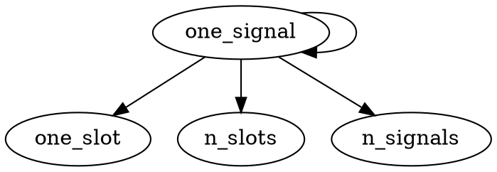

## Own Notes

#

### interface

inheriting multiple virtual functions from other classes to prevent meta object compiler issue being raised

## Notes on QT by Scythe Studio

### Signals and Slots

It is meant to work as a clean alternative for callback functionalities. Allows for a method to announce it is at a certain step/completed as opposed to having another method constantly monitor it.
At a certain point it can become difficult to maintain and debug a chain of call backs.

QT uses an notification like system - signals and slots

A function can emit a signal notifying other methods that are listening to the notification.

```cpp

class ObjectA : public QObject
    Q_OBJECT

void performOperation(){
    // code

    emit iAmDone();
}

signals: void iAmDone();

////////////

class ObjectB : public QObject
    Q_OBJECT

public slots:
    void doSomething()

```

to create a connection between 2 objects, the connect method needs to be called

it is a static function from QObject superclass

connect takes 5 arguments, but the last one is default

```cpp
// the layout of the connect method
QObject::connect(sender, signal, receiver, method);

// example usage old method using string literals
QObject::connect(ObjectA, SIGNAL(iAmDone()), ObjectB, SLOT(doSomething()));
// checks at run time
// deprecated
// namespace issues - esp when overloaded or different name spaces
// less type safe as it exposes issues at run time so there is no compile time checking


QObject::connect(ObjectA, &QObject::iAmDone, ObjectB, &ObjectB::doSomething());
// current and preferred method
// checks at compile time
// type safe
// handles overloads better as there is a pointer to the correct addresses
```

the method can be a member function, lambda, functor or a non-member function

#



signals and slots are flexible, they can be connected to multiple slots or signals but they need to match parameter types

#

### Glossary

functor:
assignments of data that preserve structure, properties and type
if called it allows for a function to be passed as an argument to another function
if a function is used, it executes and does what it needs to and is not stored any more
functor however, retains its data and properties, so if a functor has a variable within its code block, it will keep that variable stored statically until it is either released or manipulated again at a later date
